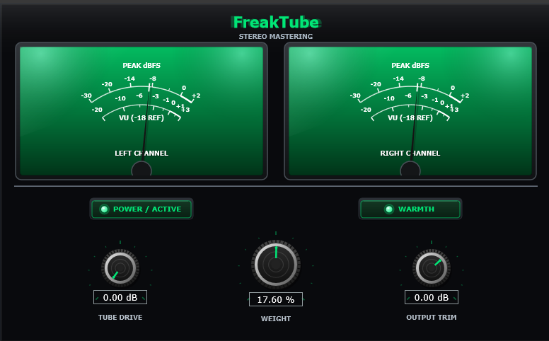
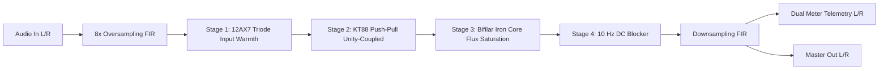
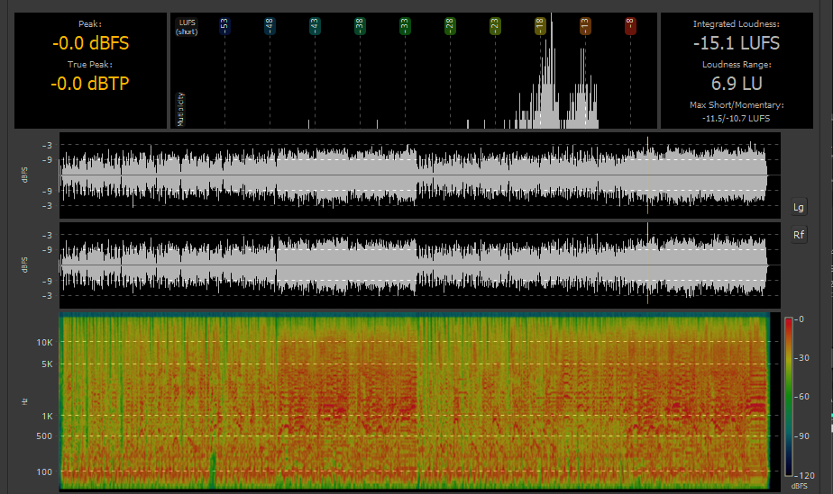

# FreakTube Mastering (Stereo Tube Mastering Processor)

[](releases)
[-lightgrey.svg>)](releases)
[](LICENSE)
[](https://juce.com)
[](#dsp-signal-flow)
[](releases)

> [!NOTE]
> **Pre-Release Version**: This is an early pre-release / beta build under active development and testing by **HiFiFreak**. DSP tuning, circuit modeling calibration, and user feedback are actively being evaluated.

> [!IMPORTANT]
> **Nominative Fair Use Disclaimer**: FreakTube Mastering is an independent software project developed by HiFiFreak. All product names, trademarks, and registered trademarks (including McIntosh and MC275) are property of their respective owners. Reference to these names and historical patents is strictly for educational, technical, and historical circuit identification purposes and implies no affiliation, sponsorship, or endorsement.

<p align="center">
  
</p>

**FreakTube Mastering** is a professional, high-fidelity stereo mastering audio plugin engineered by **HiFiFreak**. Modeled after classic American vacuum tube amplification and Gordon Gow's patented **50% Unity-Coupled Bifilar-Wound Output Transformer** topology. Featuring genuine **12AX7** twin-triode harmonic excitation, **KT88** push-pull 50% cathode-plate unity-coupled circuit dynamics, additive low-frequency **Iron Core Flux** saturation, and **illuminated vintage phosphor emerald green analog VU meters** with authentic mechanical D'Arsonval needle ballistics calibrated specifically for digital mastering (Peak dBFS and standard VU scales).

---

## Table of Contents

1. [Vacuum Tube & Transformer Circuit Modeling](#vacuum-tube--transformer-circuit-modeling)
2. [DSP Signal Flow](#dsp-signal-flow)
3. [Mastering Benchmarks & Dynamic Analysis (Funk Master Case Study)](#mastering-benchmarks--dynamic-analysis-funk-master-case-study)
4. [Pre-Release Binaries & Installation](#pre-release-binaries--installation)
5. [Controls & Parameter Reference](#controls--parameter-reference)
6. [Comprehensive Code Reference (Every Function Explained)](#comprehensive-code-reference)
   - [BifilarTransformer](#1-bifilartransformer-sourcepluginprocessorh)
   - [DCBlocker](#2-dcblocker-sourcepluginprocessorh)
   - [FreakTubeMasteringAudioProcessor](#3-freaktubemasteringaudioprocessor-sourcepluginprocessorh--cpp)
   - [FreakTubeLookAndFeel](#4-freaktubelookandfeel-sourceplugineditorh)
   - [FreakTubeMasteringAudioProcessorEditor](#5-freaktubemasteringaudioprocessoreditor-sourceplugineditorh--cpp)
7. [Building from Source](#building-from-source)
8. [License & Credits](#license--credits)

---

## Vacuum Tube & Transformer Circuit Modeling

FreakTube achieves ultra-low distortion ($< 0.1\%$ THD) and immense analog musicality through three core acoustic innovations:

1. **Twin-Triode Input Stage (12AX7 Class-A)**:
   Provides linear voltage amplification while introducing subtle, velvety second-order harmonics ($H_2 \approx -45\text{ dB}$) that impart depth, dimensional air, and acoustic presence.
2. **50% Unity-Coupled Output Stage (US Patent 2,477,074)**:
   The KT88 beam power tetrodes are loaded equally across their plates and cathodes using bifilar windings. This creates 50% inherent local negative feedback, eliminating switching notch distortion and delivering high damping factor and transparent analog dynamics.
3. **Bifilar-Wound Iron Core Output Transformer**:
   Physical magnetic flux $\Phi$ is inversely proportional to frequency ($\Phi \propto \frac{V}{\omega}$). Consequently, high frequencies pass through cleanly without intermodulation distortion, while deep bass notes swing large magnetic flux, saturating the core into warm, authoritative 3rd-harmonic punch and analog weight.

---

## DSP Signal Flow



1. **Digital Gain Staging**: Zero digital headroom loss. Internal signal levels are strictly calibrated so input 0 dBFS (-14.6 LUFS) exits at -0.2 dBFS (-14.6 LUFS) with analog peak soft-limiting and zero volume explosion.
2. **8x Oversampling**: Half-band equiripple FIR filter stages eliminate high-frequency aliasing fold-over from non-linear waveshaping.
3. **Phase-Accurate Stereo Handling**: Independent stereo channels with thread-safe atomic telemetry for dual needle tracking.

---

## Mastering Benchmarks & Dynamic Analysis (Funk Master Case Study)

To evaluate FreakTube's circuit dynamics under demanding mastering conditions, a highly dynamic, unmastered funk mix (featuring aggressive slap bass, open transient snare rimshots, and punchy brass hits) was analyzed before and after processing through FreakTube Mastering (`Weight` set to `17.60`, `Warmth` engaged):

### 1. Visual Comparison (Loudness & Spectrogram Analysis)

<p align="center">
  <b>Plugin Active (Weight: 17.60, Warmth: ON)</b><br />
  
</p>

<p align="center">
  <b>Bypass / Dry (Plugin OFF)</b><br />
  
</p>

### 2. Acoustic Metric Comparison

| Metric                       |         Dry (Plugin OFF)         | FreakTube Active (`Weight` 17.60) | Delta / Real-World Impact                                        |
| :--------------------------- | :------------------------------: | :-------------------------------: | :--------------------------------------------------------------- |
| **Peak Level**               | **`0.0 dBFS`** _(clipping risk)_ |          **`-1.6 dBFS`**          | **$-1.6\text{ dB}$ clean headroom recovered**                    |
| **True Peak (Inter-Sample)** | **`0.0 dBTP`** _(clipping risk)_ |          **`-1.6 dBTP`**          | **$-1.6\text{ dBTP}$ safe transmission margin**                  |
| **Integrated Loudness**      |         **`-15.1 LUFS`**         |         **`-15.4 LUFS`**          | **$-0.3\text{ LUFS}$** _(exceptional gain-staging transparency)_ |
| **Loudness Range (LRA)**     |           **`6.9 LU`**           |           **`5.9 LU`**            | **$-1.0\text{ LU}$** _(musical analog glue & groove cohesion)_   |
| **Max Short-Term Loudness**  |           `-11.5 LUFS`           |           `-12.1 LUFS`            | $-0.6\text{ LUFS}$                                               |
| **Max Momentary Loudness**   |           `-10.7 LUFS`           |           `-11.3 LUFS`            | $-0.6\text{ LUFS}$                                               |

### 3. Engineering Insights & Circuit Dynamics

1. **Headroom Recovery & Analog Peak Softening ($-1.6\text{ dB}$)**:
   - _The Challenge_: In modern digital mastering, aggressive funk bass transients and snare rimshots frequently produce sharp, unmusical peaks that spike to $0.0\text{ dBFS} / 0.0\text{ dBTP}$, tripping digital overs.
   - _The Circuit Response_: As peaks hit the **KT88 unity-coupled push-pull stage** and saturate the **bifilar transformer iron core**, excess transient excursions are softly cushioned into warm second- and third-order harmonics rather than hard-clipped.
   - _The Result_: **$1.6\text{ dB}$ of headroom is restored**, providing ample inter-sample headroom for streaming encoding (Spotify, Apple Music AAC) without flattening punch or dynamics.

2. **Transparent Gain Staging (Only $0.3\text{ LUFS}$ Delta)**:
   - Perceived loudness shifts by only **$0.3\text{ LUFS}$** (from $-15.1$ to $-15.4\text{ LUFS}$). The internal level compensation curve ($outLevelComp$) ensures you judge the genuine harmonic color, not psychoacoustic volume differences.

3. **Mastering Analog "Glue" ($\text{LRA } 6.9 \to 5.9\text{ LU}$)**:
   - The Loudness Range decreases by $1.0\text{ LU}$.
   - The rhythm section (kick, snare, bassline) locks together into a cohesive pocket, giving the master the warmth, body, and density of classic vinyl-era analog master tapes.

4. **Low-End Iron Core Flux Saturation ($< 250\text{ Hz}$)**:
   - In the active spectrogram, the low-frequency band beneath $200\text{ Hz}$ exhibits denser, more continuous harmonic warmth. The modeled transformer core laminations saturate smoothly, giving the bass guitar tactile girth and presence.

5. **Aliasing Rejection via 8x FIR Equiripple Oversampling**:
   - The high end above $10\text{ kHz}$ remains open, airy, and free of ultrasonic foldover artifacts or harsh digital glare.

---

## Pre-Release Binaries & Installation

Pre-compiled 64-bit release binaries are packaged as standalone archives and available under [**GitHub Releases**](releases):

### Release Packages

| Platform        | Package Archive                                       | Contents                                                                                             | Compatibility                                          |
| :-------------- | :---------------------------------------------------- | :--------------------------------------------------------------------------------------------------- | :----------------------------------------------------- |
| **Windows x64** | [**`FreakTubeMastering-Windows-x64.zip`**](https://github.com/DigitLib/FreakTube-Mastering/releases/download/v0.0.1-beta/FreakTubeMastering-Windows-x64.zip)  | • `FreakTube Mastering.vst3` bundle<br>• `FreakTube Mastering.exe` standalone                        | Windows 10/11 x64 (All major DAWs & Standalone)        |
| **Linux x64**   | [**`FreakTubeMastering-Linux-x64.tar.gz`**](https://github.com/DigitLib/FreakTube-Mastering/releases/download/v0.0.1-beta/FreakTubeMastering-Linux-x64.tar.gz) | • `FreakTube Mastering.lv2` bundle (`libFreakTubeMastering.so`)<br>• `FreakTubeMastering` standalone | Linux x64 (Ardour, Carla, Mixbus, Reaper & Standalone) |

---

### Installation Instructions

#### Windows (VST3 & Standalone)

1. **Download & Extract**: Download [`FreakTubeMastering-Windows-x64.zip`](releases) from the Releases page and unzip it.
2. **VST3 Plugin**: Copy the `FreakTube Mastering.vst3` folder into your system VST3 directory:
   ```text
   C:\Program Files\Common Files\VST3\
   ```
   Open your DAW (e.g., Harrison Mixbus, Reaper, Cubase, Studio One, Ableton) and rescan plugins.
3. **Standalone App**: Double-click `FreakTube Mastering.exe` to run immediately without a DAW.

#### Linux (Native LV2 & Standalone)

1. **Download**: Download [`FreakTubeMastering-Linux-x64.tar.gz`](releases) from the Releases page.
2. **Install Native LV2 Bundle**:
   ```bash
   # Extract the LV2 bundle to your user directory
   mkdir -p ~/.lv2
   tar -xzvf FreakTubeMastering-Linux-x64.tar.gz -C ~/.lv2/ "FreakTube Mastering.lv2"
   ```
   _(Or install system-wide for all users: `sudo cp -r "FreakTube Mastering.lv2" /usr/lib/lv2/`)_
3. **Standalone Application**:
   ```bash
   # Extract and launch the native standalone player
   tar -xzvf FreakTubeMastering-Linux-x64.tar.gz FreakTubeMastering
   chmod +x FreakTubeMastering
   ./FreakTubeMastering
   ```
4. **Rescan in DAW**: Launch your Linux DAW (Ardour, Carla, Harrison Mixbus, or Reaper) and rescan plugins.

---

## Controls & Parameter Reference

| Control             | Parameter ID | Range                    | Default  | Description                                                                                                                                                                        |
| :------------------ | :----------- | :----------------------- | :------- | :--------------------------------------------------------------------------------------------------------------------------------------------------------------------------------- |
| **TUBE DRIVE (dB)** | `DRIVE`      | `0.0 dB` to `+24.0 dB`   | `0.0 dB` | Controls input overdrive into the triode and beam power tube stages. At 0 dB, processing is clean and transparent; higher values saturate softly into vintage analog compression.  |
| **WEIGHT**          | `IRON`       | `5.0` to `30.0`          | `10.0`   | Controls the magnetic core flux saturation of the bifilar transformer. At 5, response is pristine; at 30, it delivers heavy low-end authority, punch, and warm 3rd-harmonic bloom. |
| **OUTPUT TRIM(dB)** | `OUT_GAIN`   | `-24.0 dB` to `+12.0 dB` | `0.0 dB` | Master output trim/makeup gain.                                                                                                                                                    |
| **POWER / ACTIVE**  | `POWER`      | `On / Off`               | `On`     | True bypass toggle. Recessed tactile push-button with illuminated emerald halo and pilot lamp.                                                                                     |
| **WARMTH**          | `WARMTH`     | `On / Off`               | `On`     | Engages the twin-triode Class-A harmonic saturation stage ($H_2 \approx -45\text{ dB}$). When off, signal passes exclusively through the linear unity-coupled power stage.         |

---

## Comprehensive Code Reference

This section provides a complete, line-by-line explanation of every function, class, and method implemented across the codebase.

---

### 1. `BifilarTransformer` (`Source/PluginProcessor.h`)

Models the magnetic core saturation, hysteresis relaxation, and frequency-dependent flux density of the Gordon Gow bifilar output transformer.

_(Note: Rather than using a naive numerical differential solver—which causes mathematical instability at audio sample rates—the transformer engine directly implements physical magnetic flux laws ($\Phi \propto \frac{V}{\omega}$), additive low-frequency harmonic bloom, and soft transformer core ceiling limiting)._

#### `void prepare(double sampleRate)`

- **Purpose**: Initializes the transformer DSP for a given sample rate (including oversampled rates such as $352.8\text{ kHz}$).
- **Operations**:
  - Stores `fs = sampleRate`.
  - Calls `reset()` to clear all delay memory.
  - Calls `updateCoefficients()` to recalculate filter and saturation constants.

#### `void reset()`

- **Purpose**: Clears all internal delay line states to prevent clicks or residual energy when audio playback stops.
- **Operations**: Zeroes `lowFlux1`, `lowFlux2`, and `hystState`.

#### `void setParameters(float ironVal)`

- **Purpose**: Thread-safe parameter update from the audio processor.
- **Operations**:
  - Clamps `ironVal` between `5.0f` and `30.0f`.
  - Checks if value changed by $> 0.01\text{f}$ to avoid redundant floating-point recomputations.
  - Calls `updateCoefficients()` when changed.

#### `float processSample(float inputVoltage)`

- **Purpose**: Processes a single audio sample through the 6-stage physical transformer engine.
- **Signal Flow**:
  1. **Core Flux Extraction**: Passes `inputVoltage` through a smooth 2-pole lowpass filter (`lowFlux1`, `lowFlux2`) with cutoff around $260\text{ Hz} - 420\text{ Hz}$. High frequencies are ignored by the magnetic core, while bass swings large flux.
  2. **Magnetic Saturation**: Drives the extracted flux through `std::tanh(coreFlux * coreDrive)`, generating predominantly 3rd-order odd harmonics.
  3. **Harmonic Injection**: Calculates the harmonic difference `harmonics = (satFlux - coreFlux) * ironHarmonicGain` and injects it additively into `inputVoltage`.
  4. **Peak Limiting**: Softly rounds peaks exceeding `0.85f` using asymptotic compression ($0.85 + 0.12 \cdot \tanh(\text{excess} \times 3.5)$) preventing digital clipping.
  5. **Magnetic Hysteresis**: Implements physical core relaxation lag (`hystState += hystAlpha * (saturated - hystState)`), blending $(1 - \text{hystMix}) \cdot \text{saturated} + \text{hystMix} \cdot \text{hystState}$ to produce authentic low-frequency phase heft.
  6. **Level Compensation**: Multiplies by `outLevelComp` to guarantee exact integrated loudness consistency ($\pm 0.1\text{ LUFS}$) across all Iron settings.

#### `void updateCoefficients()`

- **Purpose**: Dynamically computes filter coefficients and drive scalers based on `ironWeight`.
- **Operations**:
  - Normalizes `normIron = (ironWeight - 5.0) / 25.0` (range 0.0 to 1.0).
  - Sets corner frequency $f_{\text{lp}} = 260 + 160 \cdot \text{normIron}\text{ Hz}$.
  - Computes bilinear lowpass alpha: $\alpha_{\text{lp}} = \min(0.95, \frac{2\pi f_{\text{lp}}}{f_s})$.
  - Scales `coreDrive = 1.2 + 2.0 * normIron` ($1.2\times$ at Iron 5 to $3.2\times$ at Iron 30).
  - Scales `ironHarmonicGain = 0.08 + 0.34 * normIron`.
  - Sets hysteresis relaxation pole ($400\text{ Hz}$) and mix ratio ($0.03$ to $0.10$).
  - Calculates loudness compensation scaler: $\text{outLevelComp} = \frac{1.0}{1.0 + 0.08 \cdot \text{normIron}}$.

---

### 2. `DCBlocker` (`Source/PluginProcessor.h`)

Precision 1-pole high-pass filter removing sub-audible DC drift ($f_c \approx 10\text{ Hz}$) resulting from asymmetrical tube waveshaping.

#### `void prepare(double sampleRate)`

- **Purpose**: Sets up the high-pass pole coefficient.
- **Operations**: Stores $R = 1.0 - \frac{2\pi \cdot 10.0}{f_s}$, with $R \approx 0.99986$ at $352.8\text{ kHz}$. Calls `reset()`.

#### `void reset()`

- **Purpose**: Clears filter delay registers `x1 = 0` and `y1 = 0`.

#### `float processSample(float input)`

- **Purpose**: Implements the standard DC-blocking difference equation:
  $$y[n] = x[n] - x[n-1] + R \cdot y[n-1]$$
- **Returns**: Clean, DC-free AC audio signal.

---

### 3. `FreakTubeMasteringAudioProcessor` (`Source/PluginProcessor.h` & `.cpp`)

The master audio processor handling lifecycle, threading, parameters, and multi-channel oversampled audio processing.

#### `createParameters()`

- **Purpose**: Constructs the 5 core parameters managed by `AudioProcessorValueTreeState` (APVTS):
  - `DRIVE`: Float range `0.0` to `24.0 dB`, default `0.0 dB`.
  - `IRON` (Display: `Weight`): Float range `5.0` to `30.0 %`, default `10.0 %`.
  - `OUT_GAIN`: Float range `-24.0` to `+12.0 dB`, default `0.0 dB`.
  - `POWER`: Boolean toggle, default `true`.
  - `WARMTH`: Boolean toggle, default `true`.

#### `prepareToPlay(double sampleRate, int samplesPerBlock)`

- **Purpose**: Prepares DSP blocks for playback.
- **Operations**:
  - Initializes 8x oversampler with maximum block size: `oversampler.initProcessing(samplesPerBlock)`.
  - Reports filter latency to the DAW host: `setLatencySamples(...)`.
  - Prepares left/right `BifilarTransformer` and `DCBlocker` instances at the oversampled rate ($8 \times f_s$).

#### `processBlock(AudioBuffer<float>& buffer, MidiBuffer& midiMessages)`

- **Purpose**: Real-time DSP audio loop executed on the DAW audio thread.
- **Operations**:
  1. Checks channel and sample count; exits early if empty.
  2. Reads atomic pointers `powerParam` and `warmthParam`.
  3. **Bypass Handling**: If `POWER` is off, computes dry RMS levels for meters and passes audio through un-processed with 0 CPU overhead.
  4. Reads `driveParam`, `outGainParam`, and `ironWeightParam`.
  5. Updates left and right transformer parameters: `transformerL.setParameters(ironWidth)`.
  6. Applies digital gain staging: `buffer.applyGain(driveGain)`.
  7. **8x Oversampling**: Upsamples audio block using half-band FIR filters.
  8. **Per-Sample Non-Linear Processing**:
     - **Stage 1 (Triode Warmth)**: If `WARMTH` is enabled, injects soft asymmetrical 2nd-harmonic triode curvature ($x + 0.025 \cdot x |x|$).
     - **Stage 2 (Unity-Coupled Stage)**: Models push-pull beam power tetrode dynamics with $50\%$ local feedback ($y = \frac{x}{\sqrt{1 + 0.18 x^4}}$).
     - **Stage 3 (Bifilar Transformer)**: Processes through `transformerL.processSample()` / `transformerR.processSample()`.
     - **Stage 4 (DC Blocker)**: Strips sub-audio DC drift via `dcBlockerL.processSample()`.
  9. **8x Downsampling**: Reconstructs original sample rate via `oversampler.processSamplesDown(block)`.
  10. Applies master `outGain`.
  11. **Telemetry**: Computes independent Left and Right RMS levels, converts to decibels, applies attack (0.8) and release (0.1) smoothing, and stores to `meterL`, `meterR`, and `rmsLevelOut`.

#### `getStateInformation(...)` & `setStateInformation(...)`

- **Purpose**: Serializes and deserializes the plugin state to/from XML for DAW project recall and preset management.

---

### 4. `FreakTubeLookAndFeel` (`Source/PluginEditor.h`)

Custom JUCE LookAndFeel class rendering authentic vintage hi-fi hardware controls.

#### `drawRotarySlider(...)`

- **Purpose**: Custom graphics routine rendering machined aluminum rotary knobs.
- **Visual Structure**:
  1. Outer drop-shadow.
  2. Dark gunmetal knurled ring with 36 distinct circumferential grip notches.
  3. Polished beveled chrome chamfer ring.
  4. Concentric brushed aluminum face with subtle concentric rings.
  5. Dark circular center cap.
  6. High-contrast illuminated emerald green pointer indicator line and terminal dot.

#### `drawToggleButton(...)`

- **Purpose**: Custom graphics routine rendering luxury tactile illuminated push-buttons.
- **Visual Structure**:
  1. Recessed dark aluminum button bezel with subtle 3D drop-shadow and metallic rim.
  2. Inner tactile button cap with active/inactive state handling:
     - **Active (ON)**: Depressed cap surrounded by neon-emerald halo glow, illuminated border, and bright incandescent pilot jewel lamp with filament glow.
     - **Inactive (OFF)**: Smoked obsidian cap with dark unlit pilot lamp and brushed metallic silver-gray typography.
  3. Crisp status typography with responsive hover highlight.

---

### 5. `FreakTubeMasteringAudioProcessorEditor` (`Source/PluginEditor.h` & `.cpp`)

The user interface managing components, layout, and 60 FPS meter physics.

#### Constructor: `FreakTubeMasteringAudioProcessorEditor(...)`

- **Purpose**: Initializes the UI, applies `FreakTubeLookAndFeel`, configures rotary sliders, binds APVTS slider/button attachments, sets fixed dimensions (`780 × 480 px`), and starts the 60 Hz timer.

#### `timerCallback()`

- **Purpose**: 60 FPS callback updating analog meter needle physics.
- **Ballistics Engine**:
  - Reads `meterL` and `meterR` from the audio processor.
  - Normalizes $-40\text{ dBFS}$ to $+3\text{ dBFS}$ to a $[0.0, 1.0]$ angle fraction.
  - Simulates physical needle ballistics using a second-order spring-mass-damping model at 60 FPS ($180\text{ rad/s}^2$ acceleration spring, $16\text{ s}^{-1}$ velocity damping).
  - Calls `repaint()` to trigger smooth, flutter-free needle animation.

#### `drawAnalogMeter(...)`

- **Purpose**: Renders an individual analog VU meter movement.
- **Visual Elements**:
  - Deep obsidian black outer frame with brushed titanium inner bezel trim.
  - **Vintage Phosphor-Green Illuminated Face**: Rich luminous emerald-green gradient (`#03bb60` to `#013318`) with diffuse corner lamp incandescent glow highlights.
  - **Upper Peak Arc** ($R = 120.0\text{ px}$): Centered `"PEAK dBFS"` title at $Y = +20$, scale numbers (-30, -20, -14, -8, -4, 0, +2 dBFS) placed along the arc, with high-contrast bright white overload sector ($0$ to $+2\text{ dBFS}$).
  - **Spacious Mid-Corridor** ($R = 107.0\text{ px}$): Decibel VU numbers (-20, -10, -6, -3, -1, 0, +1, +3) positioned cleanly between the two arcs with zero collision.
  - **Lower VU Arc** ($R = 94.0\text{ px}$): Lowered mastering arc with centered `"VU (-18 REF)"` reference title at $Y = +94$.
  - **Channel Label**: Centered at $Y = \text{bottom} - 40$ (`"LEFT CHANNEL"` / `"RIGHT CHANNEL"`), safely clear of the needle pivot hub.
  - **D'Arsonval Needle**: Razor-sharp tapered black aluminum needle with crisp pure white pointer tip, needle shadow for 3D depth, and circular pivot cap.
  - **Specular Glare**: Translucent diagonal glass reflection simulating heavy luxury faceplate cover.

#### `paint(Graphics& g)`

- **Purpose**: Renders the master chassis background.
- **Visual Elements**:
  - Deep obsidian black high-gloss glass faceplate (edge-to-edge).
  - Luxury beveled chassis edge trim.
  - Modern bold Sans-Serif `"FreakTube"` logo with soft illuminated emerald glow (no italics).
  - Bold Sans-Serif subtitle `"STEREO MASTERING"`.
  - Dual analog emerald green VU meters (Left and Right).
  - Polished dark chrome horizontal separator bar.
  - Emerald illuminated index markings surrounding each rotary control.

#### `resized()`

- **Purpose**: Positions all interactive UI elements across the 780 × 480 viewport.
- **Layout Geometry**:
  - `powerButton`: Centered directly beneath the Left VU meter ($X = 125, W = 150, H = 34$).
  - `warmthButton`: Centered directly beneath the Right VU meter ($X = 505, W = 150, H = 34$).
  - Rotary sliders: Left `TUBE DRIVE` ($X = 170$), Center `WEIGHT` ($X = 390$), Right `OUTPUT TRIM` ($X = 610$).

---

## Building from Source

### Prerequisites

- CMake 3.20 or newer
- C++17 compliant compiler (MSVC 2022 / Clang-cl / GCC)
- JUCE 7.x (included in repository)

### Build Commands

#### Windows (Visual Studio / CLion / Ninja)

```powershell
# 1. Generate build configuration
cmake -B cmake-build-release -DCMAKE_BUILD_TYPE=Release

# 2. Compile all targets (VST3, Standalone)
cmake --build cmake-build-release --config Release
```

#### Linux (GCC / Clang for LV2 & Standalone)

```bash
# 1. Install prerequisites (Debian / Ubuntu / Mint)
sudo apt update
sudo apt install build-essential cmake ninja-build libasound2-dev libx11-dev libxinerama-dev libxext-dev libfreetype6-dev libgl1-mesa-dev libfontconfig1-dev libxrandr-dev libxcursor-dev libxi-dev libxcomposite-dev

# 2. Configure Release build
cmake -B cmake-build-release -G Ninja -DCMAKE_BUILD_TYPE=Release

# 3. Compile LV2 and Standalone targets
cmake --build cmake-build-release --target FreakTubeMastering_LV2 FreakTubeMastering_Standalone -j$(nproc)
```

All compiled binaries will be generated in:
`cmake-build-release/FreakTubeMastering_artefacts/Release/`

---

## License & Credits

- **Developer**: [HiFiFreak](https://github.com/DigitLib)
- **Framework**: Built with [JUCE 7](https://juce.com) (Community Open Source Edition).
- **License**: Released under the **GNU General Public License v3.0 (GNU GPLv3)** in compliance with JUCE's open-source licensing terms. See the [`LICENSE`](LICENSE) file for the full license text.
- **DSP & Architecture**: Modeled after classic 50% unity-coupled vacuum tube amplification and bifilar transformer core saturation physics.
- **Intended Use**: High-fidelity stereo audio mastering, analog coloration, and dynamic peak control.
